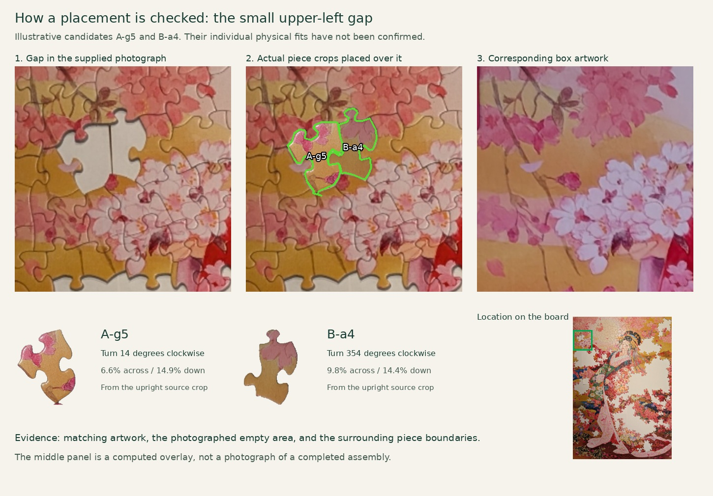

# Puzzle solver: an illustrated explanation

Read **[How it works](docs/HOW_IT_WORKS.md)** for the conceptual explanation, nine Mermaid diagrams, and examples built from the actual photographs.

The document covers piece extraction, masks and outlines, perspective correction, color and feature matching, rotation search, confidence, and browser-local progress tracking.

This example shows candidate placements, not a physically confirmed assembly. The earlier five-piece starter group was questioned by the owner and is no longer the featured example. The owner reports successfully placing roughly half of the overall suggestions; individual successful IDs have not been recorded.

## Photographs

The [photo collection](images/README.md) includes all 23 supplied image files, with embedded metadata removed from the uploaded copies. Decoded primary-image pixels were verified unchanged. Descriptive filenames contain no capture timestamps. The local originals remain untouched.

This private repository contains the documentation, source-photo exports, and explanatory figures. The executable implementation and interactive guide remain in the local project.

## License

The original documentation and the author's photographs are covered by the [MIT License](LICENSE). The puzzle artwork is excluded; see [NOTICE](NOTICE).
