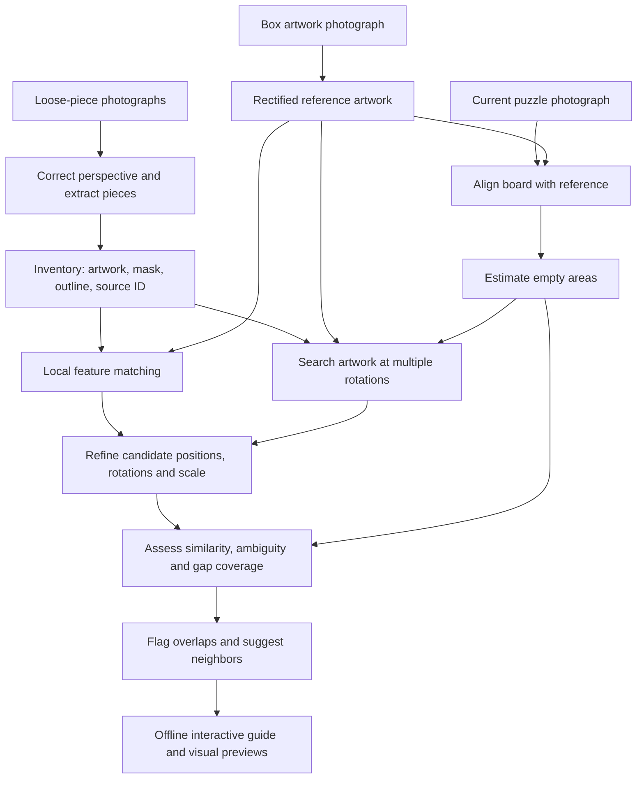
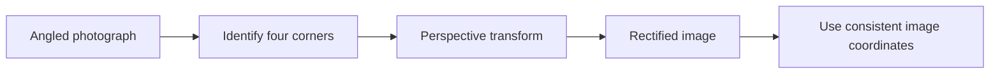
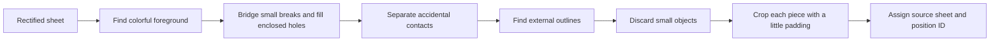
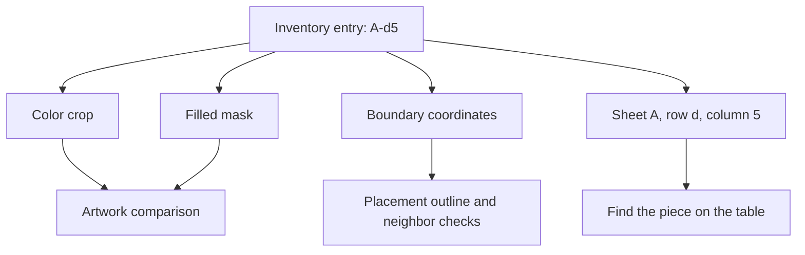
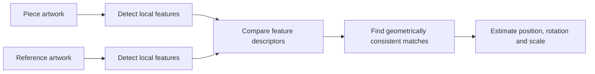
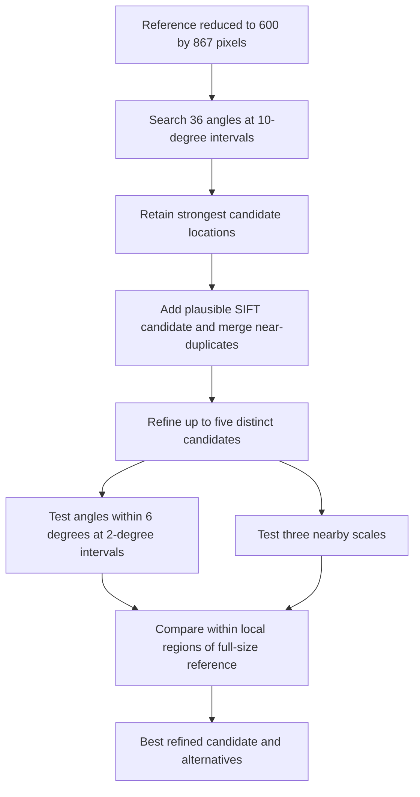
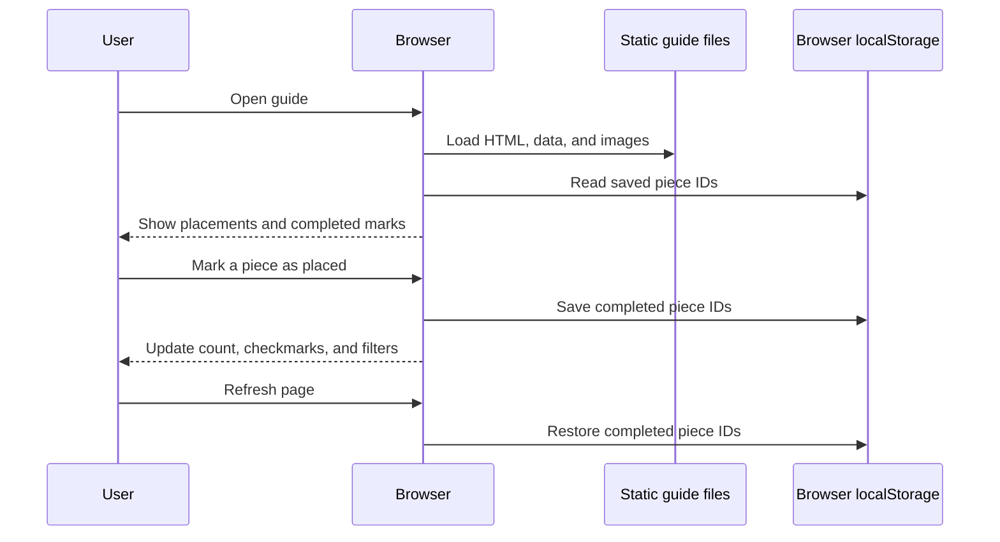
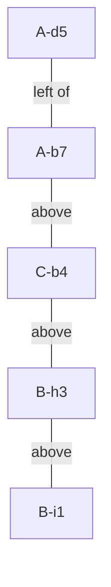

# How the photo-based puzzle solver works

This project turns photographs of loose puzzle pieces into a placement guide. It uses the completed artwork on the box to estimate **where each piece belongs and how it should be rotated**, then checks those estimates against the photographed gaps in the current puzzle.

The key advantage is having the reference artwork. A fragment of a distinctive branch can reveal an absolute location in the image, even when none of its neighboring pieces has been placed yet.

This document separates what the current code implements from possible future improvements. The diagrams use Mermaid, which GitHub can render directly.

## 1. The system at a glance



The analysis runs locally in Python using OpenCV, NumPy, SciPy, and Pillow. The browser displays its results; it does not run the image-matching algorithm. No model API or image-generation service is used by these scripts.

## 2. Correcting perspective before comparing anything

A rectangular sheet photographed at an angle appears as a quadrilateral. Distances also vary across the photograph: a piece near the camera can appear larger than one farther away.

The code specifies the four corners of each relevant sheet or artwork rectangle, then applies a **perspective transform**, also called a homography. This maps the quadrilateral to a rectangle.



The main reference and board images use a coordinate system of **1800 × 2600 pixels**. The full loose-piece sheets are rectified separately to **1400 × 2000 pixels**. Their pieces therefore need scaling before being compared with the artwork.

The current-board alignment has a second stage. It finds matching visual details in the assembled portions and in the box artwork, then estimates an additional transform from consistent matches. RANSAC rejects feature matches that disagree with the dominant geometric relationship. The initial run retained 578 consistent matches for this alignment.

**Manual calibration:** the corner coordinates are supplied explicitly in the code. This is not an automatic camera-calibration system. A new set of photographs would need new calibration.

## 3. Extracting individual pieces

The light paper beneath the pieces is useful because it usually has much less color saturation than the pink, red, and gold artwork.

The algorithm converts each rectified sheet to HSV color coordinates and creates a foreground mask. In this implementation, a pixel initially counts as foreground when its saturation exceeds 55 and its brightness exceeds 45, using OpenCV's 8-bit channel values.

Conceptually, the mask is a binary matrix:

```text
0 0 0 1 1 0 0
0 1 1 1 1 1 0
0 1 1 1 1 1 0
0 0 1 1 1 0 0

0 = background
1 = part of the piece
```

The saved image uses an alpha channel with values from 0 to 255, but the underlying distinction is the same.



Two cleanup operations matter:

- **Closing** bridges small breaks in the foreground mask.
- **Filling enclosed outlines** preserves pale artwork inside a piece instead of treating every white flower as a hole.

Small contours are discarded to avoid counting specks and handwriting as pieces. The bounding rectangle around each remaining contour defines its crop.

### What is hardcoded?

The code does not manually crop a rectangle around every piece. However, it does contain:

| Manual input | Purpose |
|---|---|
| Four corners for each relevant photograph | Correct perspective |
| Approximate row and column centers | Map detected pieces to readable source IDs |
| Nine short separating lines across the two large sheets | Break accidental contacts between nearby pieces |
| Thresholds and expected scale ranges | Adapt extraction and matching to this photo set |

Already joined pieces can remain a single inventory entry. Some other contacts are not completely separated. The annotated sheets are therefore the authoritative way to identify an entry; an entry is not guaranteed to be exactly one physical piece.

## 4. Keep artwork, mask, and outline together

A binary mask alone discards the most distinctive evidence: the printed picture.

| Representation | Meaning | Main use |
|---|---|---|
| Color image | Artwork visible on the piece | Find the corresponding region of the box image |
| Filled mask | Which pixels belong to the piece | Ignore surrounding paper and measure overlap |
| Outline coordinates | The boundary of the piece | Draw placements and estimate nearby pieces |
| Source metadata | Sheet, row, column, crop rectangle, ID | Find the physical piece again |



The mask is slightly eroded before artwork comparison. Removing a narrow border reduces the influence of paper, shadows, and imperfect segmentation around the edge. The full outline is retained for display and later geometric checks.

## 5. Matching artwork to the box image

Each piece has an unknown position, rotation, and scale. In simplified form, a point on the piece is mapped into the reference as:

```text
reference point = scale × rotation(piece point) + translation
```

The code generates candidate transformations using two complementary methods.

### Method A: local visual features

SIFT detects distinctive image details and describes the surrounding pattern in a way that tolerates changes in rotation and scale. The matching code uses grayscale artwork for this stage.

Imagine recognizing the same fork in a brown branch on both a loose piece and the box image. Several consistent correspondences can establish where the piece belongs. RANSAC helps reject unrelated correspondences before estimating the transformation.



This works well for distinctive printed details. It is less reliable for plain gold regions, repeated blossoms, or glare. Feature matching alone did not provide sufficient coverage for this puzzle.

### Method B: masked image correlation

The second method treats the piece as an image template. It moves the template over the reference and computes a similarity score at each possible location. Pixels outside the piece mask do not participate in the comparison.

```text
For each tested angle:
    rotate and scale the artwork and its mask
    compare against locations throughout the reference
    discard scores whose candidate center is outside a likely gap
    retain strong candidate peaks
```

The result of a search is a **score map**: a matrix in which each value describes the similarity at one candidate location. The implementation keeps two spatially separated peaks per tested angle, then retains the eight strongest candidates overall.

The score uses normalized correlation. Conceptually, it compares the pattern of deviations from the average channel values, normalized by their magnitude. This reduces sensitivity to some brightness and contrast differences, but it does not make the comparison immune to lighting changes.

### How color enters the comparison

For this dense search, images are converted to Lab:

- **L** describes lightness.
- **a** and **b** describe two color axes.

The lightness channel is downweighted relative to the color channels. A slight blur also reduces fine photographic or printed texture.

This compares the arrangement of colors and lines: a pink petal at one location, gold beside it, and a dark branch underneath. It uses substantially more information than average color alone.

Glare is still difficult. If a reflection obscures the artwork, color conversion and normalization cannot reconstruct the missing detail.

## 6. Handling rotation without testing every degree everywhere

The search uses a coarse stage followed by a more precise local stage.



The coarse stage uses an expected scale derived from the photographs. The refinement stage tests scales of 0.56, 0.577, and 0.595 from the rectified piece crop into the full-size reference. These are photo-specific parameters.

For example, a promising initial orientation of 170 degrees is refined around 164–176 degrees. Precise comparisons are concentrated around promising positions instead of repeated over the entire artwork.

This is a practical speed–accuracy tradeoff. A coarse search can miss a correct candidate, and a candidate discarded early cannot be recovered by local refinement.

## 7. Using the assembled puzzle as a constraint

Once the current board is aligned with the reference, its pale backing indicates probable gaps. The code detects low-saturation, sufficiently bright pixels, cleans the mask, and expands it slightly to tolerate alignment error.

For a candidate piece transformation, the code estimates:

```text
gap fraction = transformed mask area inside likely gaps
               ----------------------------------------
                    total transformed mask area
```

The scoring mask is eroded and the gap mask is slightly expanded, so this is a tolerant consistency check rather than an exact mechanical fit measurement.

A piece whose artwork matches somewhere already occupied is suspicious. A piece whose artwork matches inside a photographed gap has stronger support.

However, a large multi-piece hole has only an outer boundary. Its interior does not reveal the individual missing-piece outlines. Gap detection cannot determine those interior placements by shape alone.

## 8. Confidence, ambiguity, overlaps, and neighbors

The current classifier uses explicit heuristics in `publish.py`:

| Classification | Artwork correlation | Gap fraction | Additional condition |
|---|---:|---:|---|
| High | At least 0.90 | At least 0.84 | Alternative-score margin at least 0.025, or at least 4 supporting SIFT matches, or no retained distinct alternative |
| Medium | At least 0.80 | At least 0.72 | Alternative-score margin at least 0.018, or at least 3 supporting SIFT matches, or no retained distinct alternative |
| Unresolved | Fails the applicable conditions, or no candidate | — | No location published |

These thresholds are engineering choices, not learned or statistically calibrated probabilities. Absence of a retained alternative does not prove that the true alternative was considered: the earlier search may have discarded it.

After classification, the code checks proposed placements for substantial overlap. It records conflicts when the intersection exceeds 15% of the smaller mask area, using reduced masks. **It flags conflicts; it does not automatically solve them or choose a globally optimal set of placements.** The published run had no flagged conflicts.

Neighbor suggestions use the proximity of transformed contours and a low-overlap condition. They suggest which pieces to try together, but do not explicitly verify complementary tabs and sockets.

The saved result contains **109 high-confidence suggestions, 19 medium-confidence suggestions, and 19 unresolved entries**, out of 147 entries. The approximately 74% high-confidence figure is **coverage of photographed entries**, not measured placement accuracy or percentage of the entire puzzle solved.

## 9. Why direct pairwise shape matching is harder

Two neighboring pieces do not have identical silhouettes. Their adjoining boundary segments are complementary, with the solid interiors on opposite sides of the seam.

Simply rotating two filled masks and maximizing overlap tends to find similar shapes, not valid joins.

A stronger direct edge matcher would need the following stages:

```mermaid
flowchart LR
    Contours[Piece contours] --> Sections[Identify candidate boundary sections]
    Sections --> Prune[Reject incompatible lengths and shapes]
    Prune --> Align[Align opposing boundary sections]
    Align --> Fit[Measure seam gaps and interior overlap]
    Fit --> Color[Check artwork continuity across seam]
    Color --> Proposals[Rank possible joins]
    Proposals --> Global[Choose a mutually consistent assembly]
```



This diagram describes a potential extension, **not the current implementation**.

Artwork continuity matters because many pieces can have similar-looking tabs. A branch approaching an edge should continue in a compatible direction on the adjacent piece.

For `n` pieces, there are `n(n−1)/2` unordered piece pairs. Testing 360 orientations for every pair accounts for only part of the work: the matcher must also choose translations, boundary sections, and possibly scale corrections, then compare their pixels or contour points.

The reference-based search has a different approximate brute-force cost:

```text
pieces × tested angles × candidate positions × pixels compared
```

OpenCV performs the image operations in optimized native code. Downsampling and local refinement reduce the work, and the dense/refinement scripts process up to four pieces concurrently. This does not establish mathematical optimality; it makes the chosen search practical for this photo set.

## 10. What a stronger solver would add

The most useful next step is to keep multiple candidate placements per piece and resolve them jointly using artwork and shape constraints.

For example, candidate A might have the best isolated image score but overlap another strongly identified piece. Candidate B might score slightly lower while agreeing with both neighboring edges. A global selection stage could favor B.

Other useful extensions would include automatic sheet calibration, better separation of touching pieces, combining several photographs to avoid glare, and explicit tab/socket compatibility scoring.

The present system intentionally remains a practical aid: it suggests placements with visible evidence and leaves uncertain entries unresolved.

## 11. The browser guide and saved progress

The analysis publishes static data, crops, previews, and maps. The browser reads `guide-data.js`, which assigns the result to `window.PUZZLE_DATA`.



Progress belongs to the browser and its origin: protocol, host, and port. Opening a different address or using another browser does not automatically share those marks. A local HTTP server only serves the files; it does not receive or store assembly progress.

Marking a piece complete also does not rerun matching or modify the current-board photograph. It records the user's confirmed progress in the interface.

## 12. Mapping concepts to files

| File | Responsibility |
|---|---|
| `scripts/solve.py` | Perspective correction, piece extraction, inventory, and SIFT candidates |
| `scripts/dense.py` | Coarse search using masked artwork correlation |
| `scripts/refine.py` | Local refinement and gap-coverage assessment |
| `scripts/publish.py` | Confidence classification, overlap reporting, neighbors, and guide data |
| `scripts/starter.py` | Five-piece starter illustration |
| `output/index.html` | Interactive viewer and browser-local progress |
| `output/guide-data.json` | Published placements and confidence labels |

These paths identify files in the local implementation. The documentation can be read independently of the code, source photographs, and generated guide.

For a concrete example, the proposed starter group has the following arrangement:



In this example, the artwork locates the pieces around the brown branch. Their transformed outlines then provide additional evidence that the proposed arrangement is plausible. The physical joins remain the final check.
